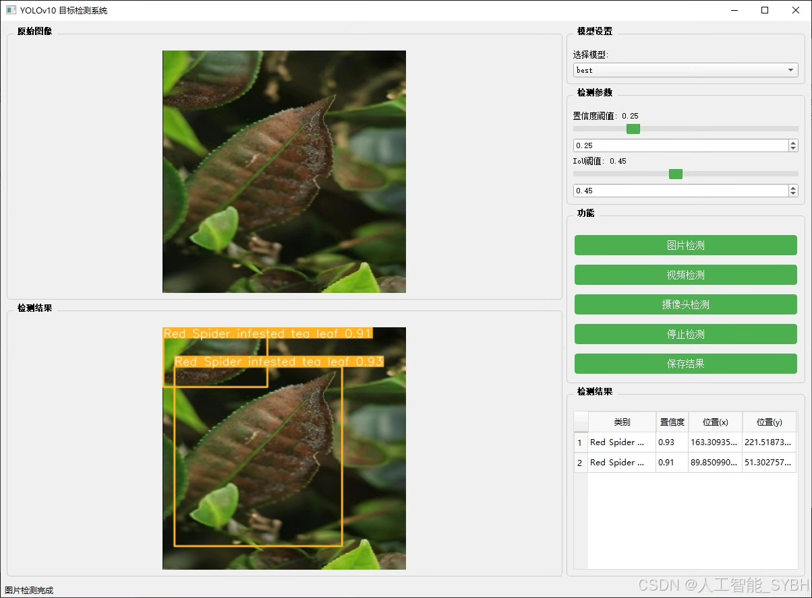
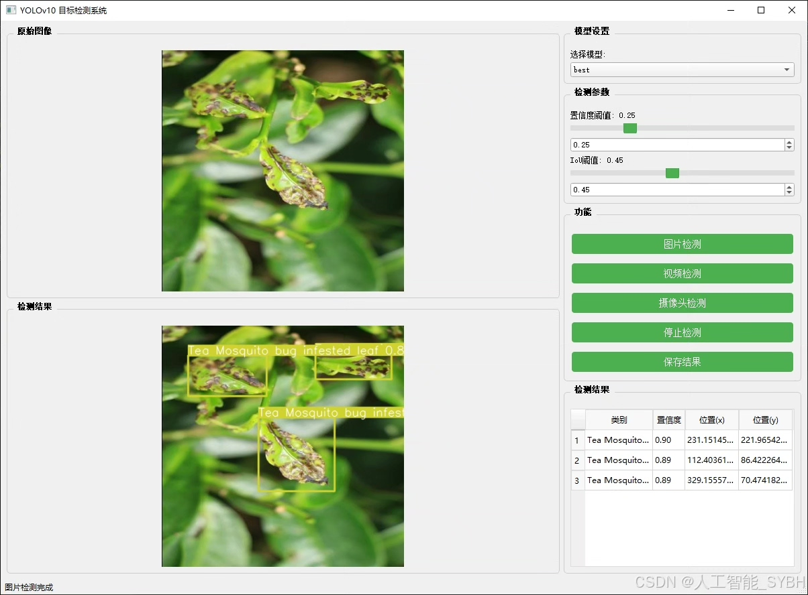
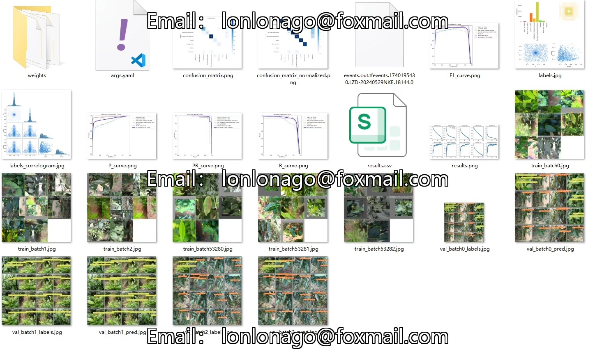
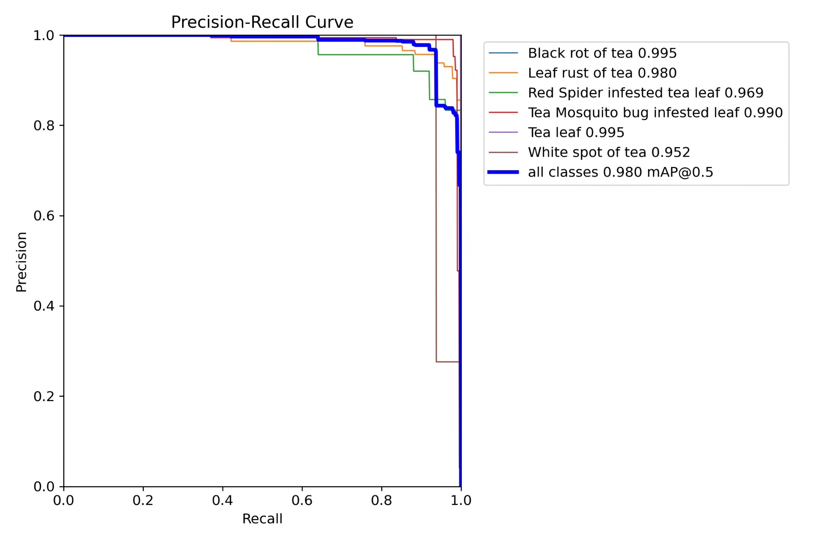
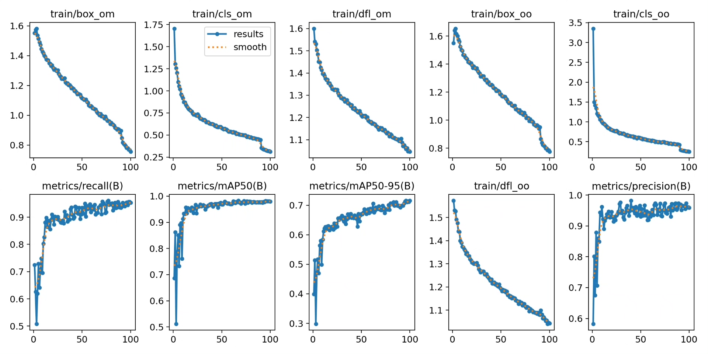
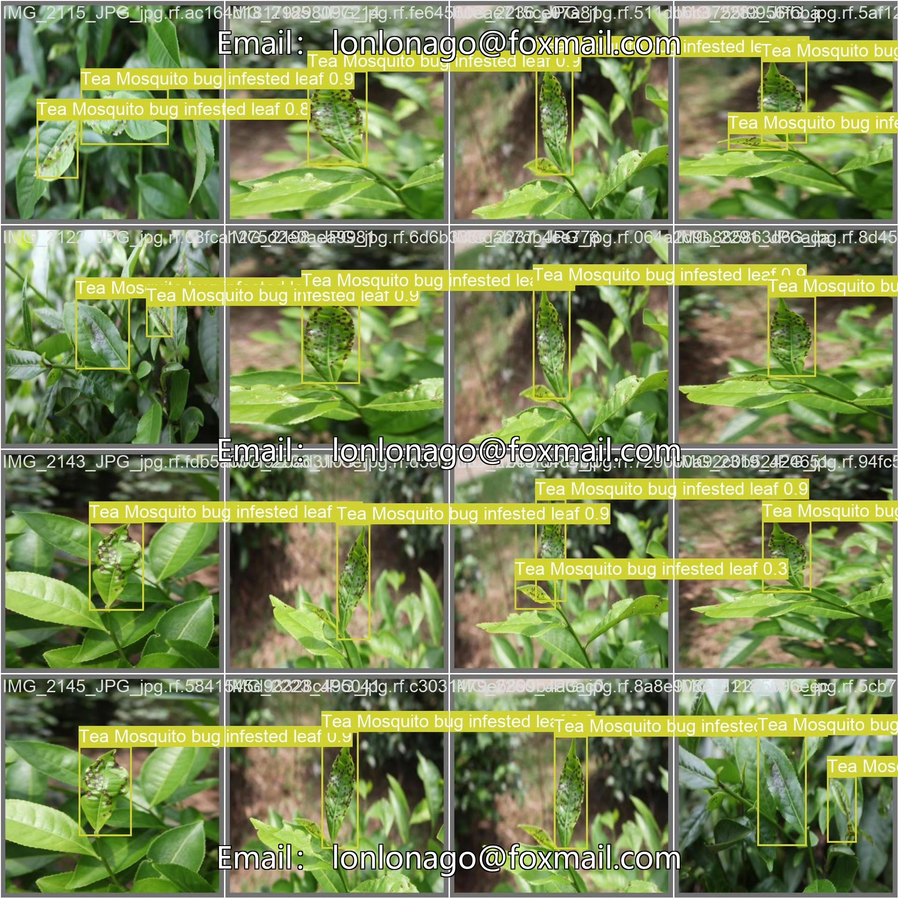
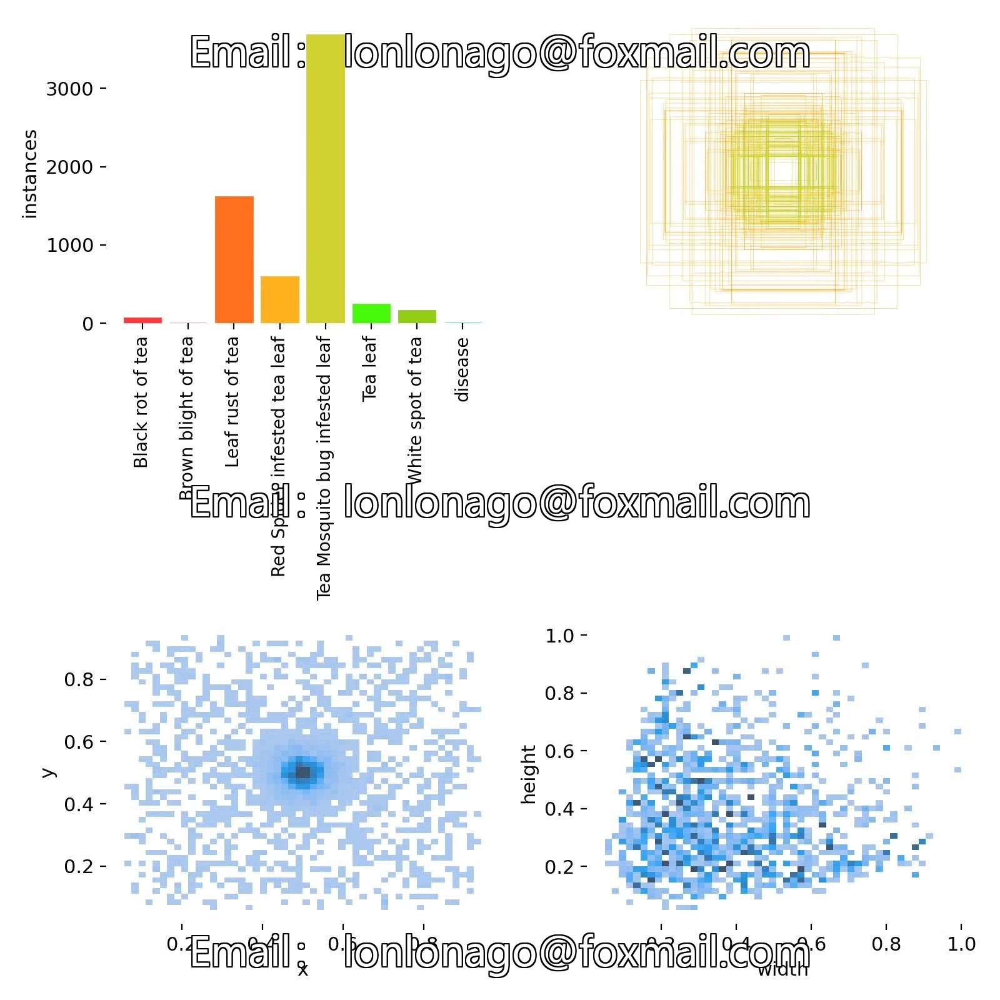
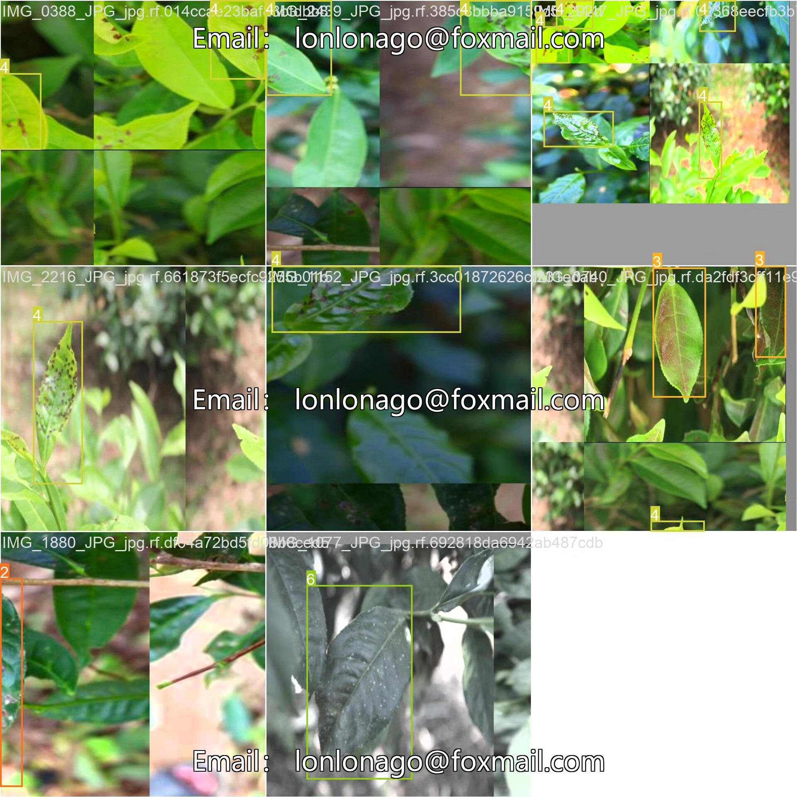

# Tea disease detection system based on deep learning YOLOv10

## Body

Based on the deep learning YOLOv10, a tea disease detection system (YOLOv10+YOLO dataset + UI interface + Python project source code + model)

Tea diseases are one of the important factors affecting the yield and quality of tea. Traditional disease detection methods mainly rely on manual observation and subjective judgment, which is inefficient and easily influenced by subjective factors. With the development of computer vision and deep learning technology, image-based target detection methods have gradually become a hot research topic in tea disease detection. The YOLO (You Only Look Once) series algorithms, due to their efficiency and accuracy, have been widely applied in the field of target detection. This project aims to develop a system that can automatically detect tea diseases based on the YOLOv10 model, helping tea farmers improve the efficiency of disease identification and reduce losses.

The company's products have obtained the official commercial license certification from YOLO.

We provide after-sales service.

After payment, we will provide WeChat ID for any questions anytime.

Environmental configuration: We will provide an instruction tutorial for environmental configuration, and WeChat will provide answers.

Remote installation service: If you need remote configuration, an additional fee of 69 is required,
If the configuration fails, all fees will be refunded (specially for old computers only refund installation fees).

Retraining dataset: After configuring the environment, you can train on your own computer.
If you need us to retrain, just pay 69 plus computing power fees (2.5 yuan/hour)

Full after-sales service

## Images

## Payment

Here is a pay link on Stripe ( https://buy.stripe.com/3cs8yP7sY87d0vu9AB ). Please contact me lonlonago@foxmail.com after funding $89, and I will send you a complete data files , thank you!

